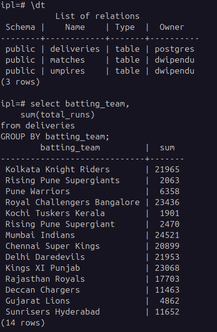
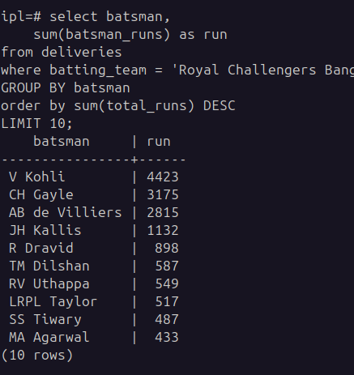
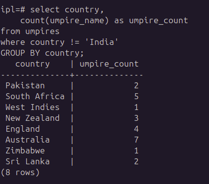
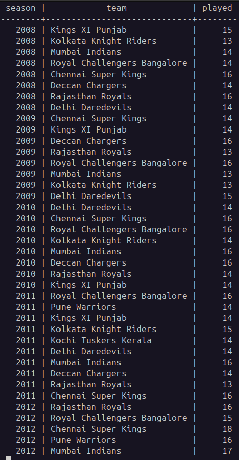
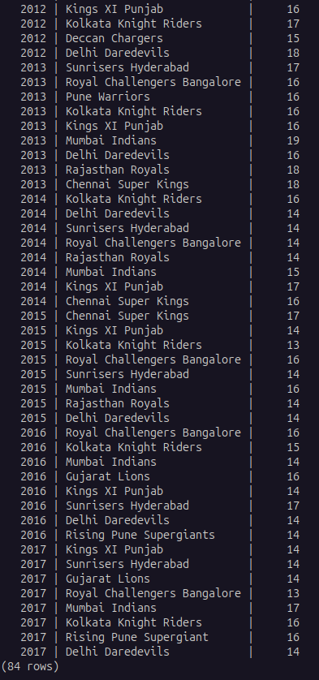
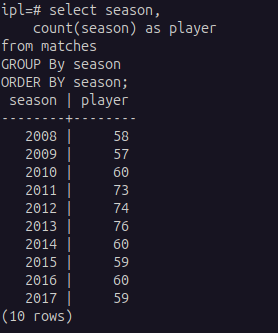
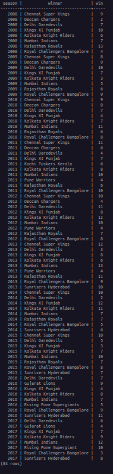
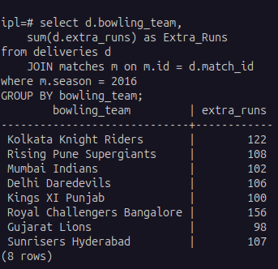
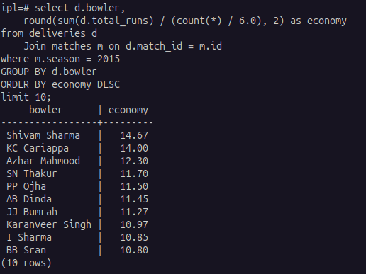

# IPL Data Analysis

This project provides SQL scripts and instructions to analyze IPL (Indian Premier League) cricket data using PostgreSQL.

## Prerequisites

- **PostgreSQL**: Ensure PostgreSQL is installed on your system.
- **Git**: Required to clone the repository.

## Setup Instructions

1. **Clone the Repository**

   ```bash
   git clone git@github.com:DwipenduKundu/data-project-database.git
   cd data-project-database
   ```

2. **Create the Database**

   Execute the script to create a new database for the project:

   ```bash
   psql -U <ipl_user> -f create.sql
   ```

3. **Create Tables**

   Set up the required tables by running:

   ```bash
   psql -U <ipl_user> -d <ipl_database_name> -f create_table.sql
   ```

4. **Run Analysis Tasks**

   Execute the analysis queries and tasks:

   ```bash
   psql -U <ipl_user> -d <ipl_database_name> -f localhost.session.sql
   ```

## Notes

- Replace `ipl_user` with your PostgreSQL username.
- Replace `ipl_database_name` with the name of the database created in step 3.
- Ensure you have the necessary permissions to create databases and tables.

## Project Structure

- `create.sql` – Creates the IPL database.
- `create_table.sql` – Defines and creates all required tables.
- `localhost.session.sql` – Contains SQL queries for analysis tasks.
```  
data-project-database
├── data
│   ├──  deliveries.csv
│   ├── matches.csv
│   └── umpires.csv
│ 
├── Output
│   ├── output-1.png
│   ├── output-2.png
│   ├── output-3.png
│   ├── output-4_1.png
│   ├── output-4_2.png
│   ├── output-5.png
│   ├── output-6.png
│   ├── output-7.png
│   ├── output-8.png
│   └── output-1.png
│
├──create.sql
├──create_table.sql
├──load.sql
└──localhost.session.sql
```

## Sample Outputs

1. 
2. 
3. 
4. 
5. 
6. 
7. 
8. 
9. # data-project-database
